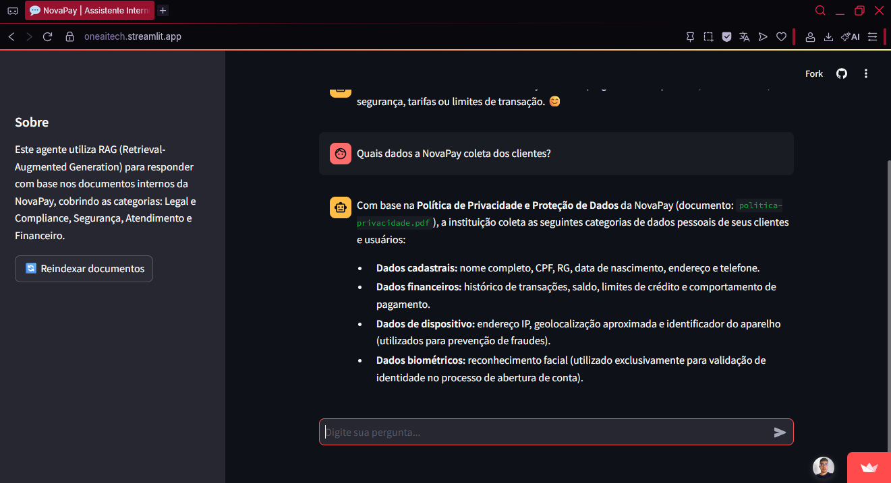
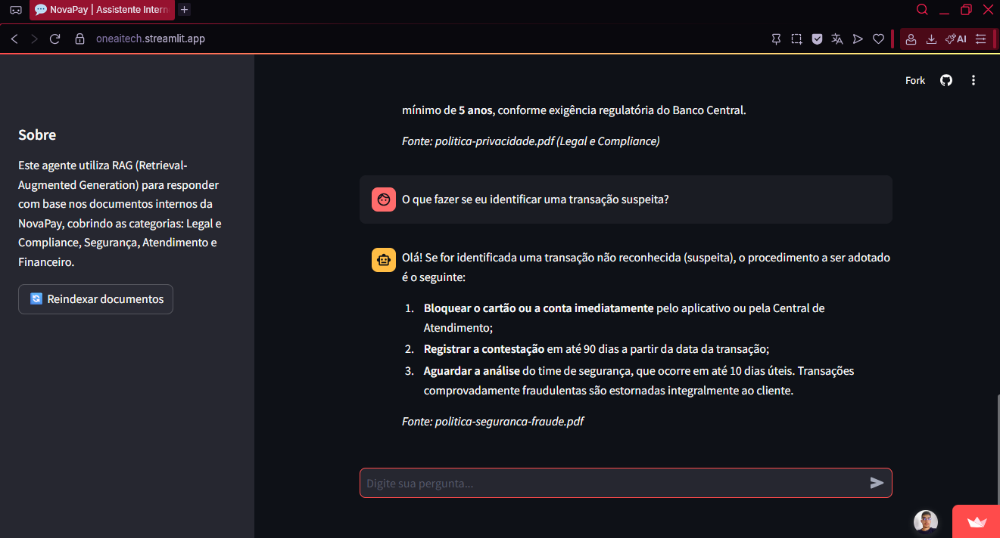

# 🏦 ONE_AI_TECH — Assistente Corporativo NovaPay

### Agente de IA com RAG para consulta de documentos internos

**Projeto desenvolvido para o desafio final da Oracle Next Education (ONE) — trilha AI for Tech, em parceria com a Alura.**


### 🌐 [TESTAR A APLICAÇÃO](https://oneaitech.streamlit.app)

> Se o app estiver "dormindo" (comum em hospedagem gratuita), clique em **"Yes, get this app back up!"** e aguarde cerca de 1 minuto.

---

## 📌 Sobre o projeto

O **ONE_AI_TECH** é um agente de inteligência artificial corporativo, aberto a todos os colaboradores, capaz de responder perguntas com base em documentos internos de uma empresa fictícia — a **NovaPay**, uma fintech/banco digital.

O agente funciona como uma base de conhecimento conversacional: em vez de o colaborador precisar procurar manualmente em políticas, termos de uso e tabelas de tarifas, ele simplesmente pergunta em linguagem natural e recebe uma resposta baseada exclusivamente nos documentos oficiais da empresa, com indicação da fonte.

---

## 🎯 O problema

Documentos corporativos costumam estar espalhados em formatos diferentes (PDF, planilhas, textos) e departamentos diferentes (Legal, Financeiro, Segurança, Atendimento). Encontrar uma informação específica — como um limite de transação ou uma cláusula de política de privacidade — consome tempo e gera dependência de outras pessoas ou áreas.

## 💡 A solução

O agente utiliza uma arquitetura **RAG (Retrieval-Augmented Generation)**: os documentos são convertidos em vetores semânticos e indexados; quando o colaborador faz uma pergunta, o sistema busca os trechos mais relevantes e os envia, junto com a pergunta, para um LLM gerar uma resposta fundamentada — sempre citando de qual documento a informação foi extraída, e admitindo quando não encontra a resposta em vez de inventar.

---

## 🏗️ Arquitetura

```
                         ┌──────────────────┐
                         │    Documentos    │
                         │                  │
                         │  PDF · Markdown  │
                         │       CSV        │
                         └────────┬─────────┘
                                  │
                                  ▼
                         ┌──────────────────┐
                         │     Ingestion    │
                         │                  │
                         │  Carrega arquivos│
                         │ + metadados      │
                         │ (categoria/origem)│
                         └────────┬─────────┘
                                  │
                                  ▼
                         ┌──────────────────┐
                         │  Text Splitter   │
                         │                  │
                         │ chunks ~1000     │
                         │ overlap 150      │
                         └────────┬─────────┘
                                  │
                                  ▼
                       ┌────────────────────┐
                       │  Gemini Embeddings │
                       │ gemini-embedding-2 │
                       └─────────┬──────────┘
                                 │
                                 ▼
                         ┌──────────────────┐
                         │     ChromaDB     │
                         │   Vector Store   │
                         └────────┬─────────┘
                                  │
                         pergunta do usuário
                                  │
                                  ▼
                         ┌──────────────────┐
                         │     Retriever    │
                         │      TOP_K=4     │
                         └────────┬─────────┘
                                  │
                                  ▼
                         ┌──────────────────┐
                         │  Contexto +      │
                         │  System Prompt   │
                         └────────┬─────────┘
                                  │
                                  ▼
                         ┌──────────────────┐
                         │  Gemini 3.5      │
                         │     Flash        │
                         └────────┬─────────┘
                                  │
                                  ▼
                         ┌──────────────────┐
                         │     Resposta     │
                         │ (com citação da  │
                         │     fonte)       │
                         └──────────────────┘
```

---

## 📚 Base de conhecimento (NovaPay)

Documentos fictícios, organizados por categoria de negócio, cobrindo múltiplos formatos:

| Documento | Categoria | Formato |
|---|---|---|
| Política de Privacidade e Proteção de Dados | Legal e Compliance | PDF |
| Termos e Condições de Uso | Legal e Compliance | PDF |
| Política de Segurança e Prevenção de Fraudes | Segurança | PDF |
| FAQ — Transações e Limites | Atendimento e Suporte | Markdown |
| Tarifas e Comissões | Financeiro e Comercial | CSV |

Todos os documentos foram gerados com auxílio de IA, contendo dados fictícios coerentes entre si.

---

## 🚀 Funcionalidades

- 💬 Chat conversacional em linguagem natural
- 🔎 Busca semântica nos documentos internos (não depende de palavras exatas)
- 📄 Citação da fonte (nome do arquivo e categoria) em cada resposta
- 🙅 Reconhecimento de limites: quando a informação não está nos documentos, o agente informa isso claramente, em vez de inventar uma resposta
- 🧵 Histórico de conversa mantido durante a sessão
- 🔓 Acesso aberto, sem autenticação — qualquer colaborador pode usar

---

## 🛠️ Tecnologias utilizadas

| Camada | Tecnologia |
|---|---|
| 🎨 Interface | Streamlit |
| 🧠 Orquestração RAG | LangChain |
| ✨ LLM | Google Gemini (`gemini-3.5-flash`) |
| 🔢 Embeddings | Google Gemini (`gemini-embedding-2`) |
| 🗃️ Banco vetorial | ChromaDB |
| 📄 Extração de documentos | PyPDF, CSVLoader, TextLoader |
| 🔐 Variáveis de ambiente | python-dotenv |
| ☁️ Hospedagem | Streamlit Community Cloud |

---

## ☁️ Deploy

O agente está publicado no **Streamlit Community Cloud**, com deploy contínuo a partir deste repositório: qualquer atualização enviada à branch `main` é refletida automaticamente na aplicação publicada.

**Aplicação online:** [oneaitech.streamlit.app](https://oneaitech.streamlit.app)

### Demonstração : 







## 📂 Estrutura do repositório

```
ONE_AI_TECH/
│
├── docs/                          # Base de documentos da NovaPay
│   ├── politica-privacidade.pdf
│   ├── termos-uso.pdf
│   ├── politica-seguranca-fraude.pdf
│   ├── faq-transacoes-limites.md
│   └── tarifas-comissoes.csv
│
├── src/
│   ├── config.py                  # Configurações centrais (.env / secrets)
│   ├── ingestion.py                # Leitura dos documentos + metadados
│   ├── rag_chain.py                # Chunking, embeddings, busca e geração
│   └── app.py                      # Interface do chat (Streamlit)
│
├── requirements.txt
├── .env.example
├── .gitignore
└── README.md
```

---

## ⚙️ Como executar localmente

### 1. Clone o repositório

```bash
git clone https://github.com/SEU_USUARIO/ONE_AI_TECH.git
cd ONE_AI_TECH
```

### 2. Crie e ative um ambiente virtual

```bash
python -m venv venv

# Windows
venv\Scripts\activate

# Linux/macOS
source venv/bin/activate
```

### 3. Instale as dependências

```bash
pip install -r requirements.txt
```

### 4. Configure sua chave de API

Copie o arquivo de exemplo:

```bash
cp .env.example .env
```

Gere uma chave gratuita em [aistudio.google.com/apikey](https://aistudio.google.com/apikey) e cole no `.env`:

```
GOOGLE_API_KEY=sua_chave_aqui
```

> ⚠️ O arquivo `.env` nunca deve ser enviado ao GitHub — ele já está listado no `.gitignore`.

### 5. Rode a aplicação

```bash
streamlit run src/app.py
```

Acesse `http://localhost:8501` no navegador.

---

## 🧪 Exemplos de perguntas para testar

```
Quais dados a NovaPay coleta dos clientes?
```

```
Qual o limite de PIX durante a noite?
```

```
Quanto custa um saque internacional no cartão de crédito?
```

```
O que fazer se eu identificar uma transação suspeita?
```

```
Como solicito a exclusão dos meus dados pessoais?
```

---

## 🧠 Decisões técnicas

- **Escopo de formatos:** o desafio permite flexibilidade na escolha dos formatos de documento; optou-se por PDF, Markdown e CSV, cobrindo tanto texto corrido quanto dados tabulares, sem adicionar complexidade desnecessária de formatos não utilizados (Word, Excel, PowerPoint, JSON, HTML).
- **LLM e embeddings gratuitos:** o projeto utiliza o free tier da API do Google Gemini, sem custo e sem necessidade de cartão de crédito.
- **Banco vetorial local (ChromaDB):** escolhido pela simplicidade de configuração, adequado ao volume de documentos deste desafio.
- **Prompt restritivo:** o agente é instruído a responder apenas com base no contexto recuperado dos documentos, evitando alucinações, e a admitir explicitamente quando a informação não está disponível na base.
- **Metadados de categoria:** cada chunk carrega a categoria de negócio e o arquivo de origem, permitindo rastreabilidade da resposta.

---

## 🗺️ Possíveis evoluções futuras

- [ ] Filtro de busca por categoria de documento
- [ ] Botão de feedback (👍/👎) por resposta
- [ ] Indicação de página/seção na citação da fonte
- [ ] Suporte a mais formatos de documento (Word, Excel, PowerPoint)
- [ ] Pipeline automatizado de atualização de documentos
- [ ] Monitoramento de perguntas sem resposta satisfatória

---

## 👤 Autor

Projeto desenvolvido como parte do desafio **Alura Agentes — ONE (Oracle Next Education) AI for Tech**, aplicando conceitos de RAG, LLMs, engenharia de prompt, bancos vetoriais e deploy em nuvem.